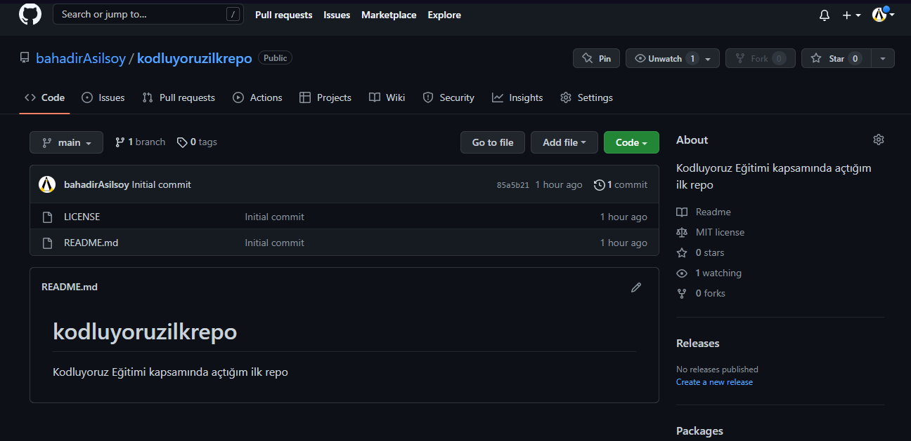

# Kodluyoruz Ilk Repo
Kodluyoruz Eğitimi kapsamında açtığım ilk repo

*Bu repo Kodluyoruz Front-end Eğitiminde oluşturduğumuz ilk repo. İçerisinde bir adet README dosyası, bir adet de index.hmlt barındırıyor.*



## Installation

*Öncelikle projeyi clonelayın. (Buraya sizin reponuzdan aldığınız link gelecek)*

```
git clone https://github.com/bahadirAsilsoy/kodluyoruzilkrepo.git
```

## Usage

*Projeyi cloneladıktan sonra Visual Studio Code programında açınız*

*Linux İçin*

```
cd kodluyoruzilkrepo
code .
```
## Contributing

*Pull requestler kabul edilir. Büyük değişikler için, lütfen önce neyi değiştirmek istediğinizi tartışmak için bir konu açınız.*

## License

[MIT](https://choosealicense.com/licenses/mit/)
